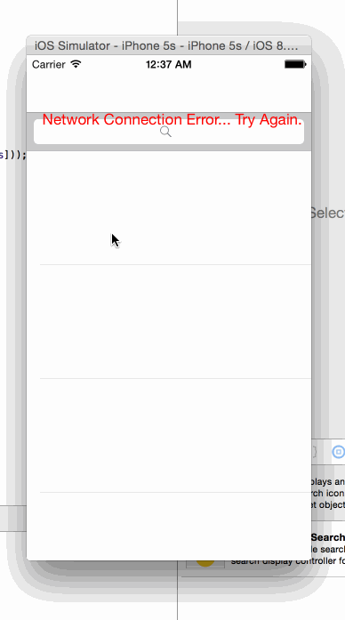

## Rotten Tomatoes
This is a movies app displaying box office and top rental DVDs using the [Rotten Tomatoes API](http://developer.rottentomatoes.com/docs/read/JSON).

####Time spent: 8

### Features

#### Required

- [x] User can view a list of movies. Poster images load asynchronously.
- [x] User can view movie details by tapping on a cell.
- [x] User sees loading state while waiting for the API.
- [x] User sees error message when there is a networking error.
- [x] User can pull to refresh the movie list.

#### Optional

- [x] Image fade in
- [x] For the larger poster, load the low-res first and switch to high-res when complete.

### Walkthrough

